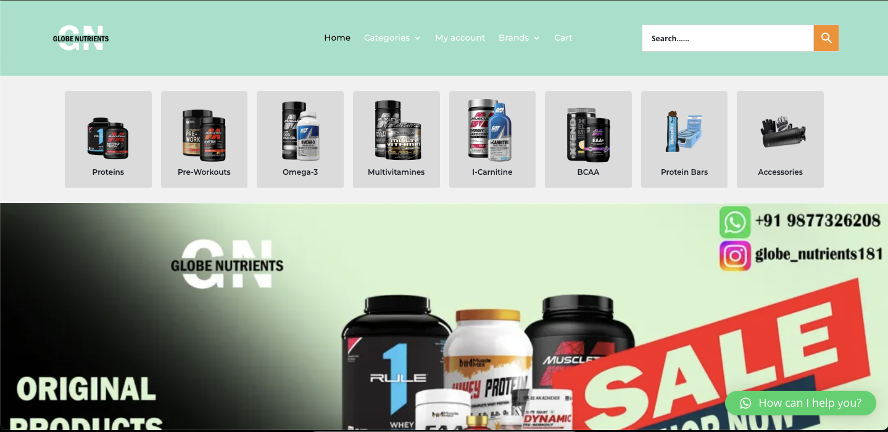

# Globe Nutrients Clone

This is a **clone of [Globe Nutrients](https://globenutrients.com/)** website built using **React.js**, **HTML**, **Tailwind CSS**, and **JavaScript**. The project demonstrates the frontend development skills and usage of modern React libraries.




## 💻 Tech Stack

| Technology | Description |
|------------|-------------|
|  **HTML5** | Markup language for structuring web pages |
|  **Tailwind CSS** | Utility-first CSS framework for styling |
|  **JavaScript** | Programming language for interactivity |
|  **React.js** | Frontend library for building UI |
|  **React Router DOM** | Declarative routing for React |
|  **React Icons** | Icon library for React |


## 🚀 Features

- Fully responsive website design
- Smooth navigation using React Router
- Modern UI with Tailwind CSS
- Reusable React components
- Icon usage via React Icons


---

## 🛠️ Installation

1. Clone the repository:

```bash
git clone https://github.com/singhayush007/GLOBE_NUTRIENTS_CLONE.git